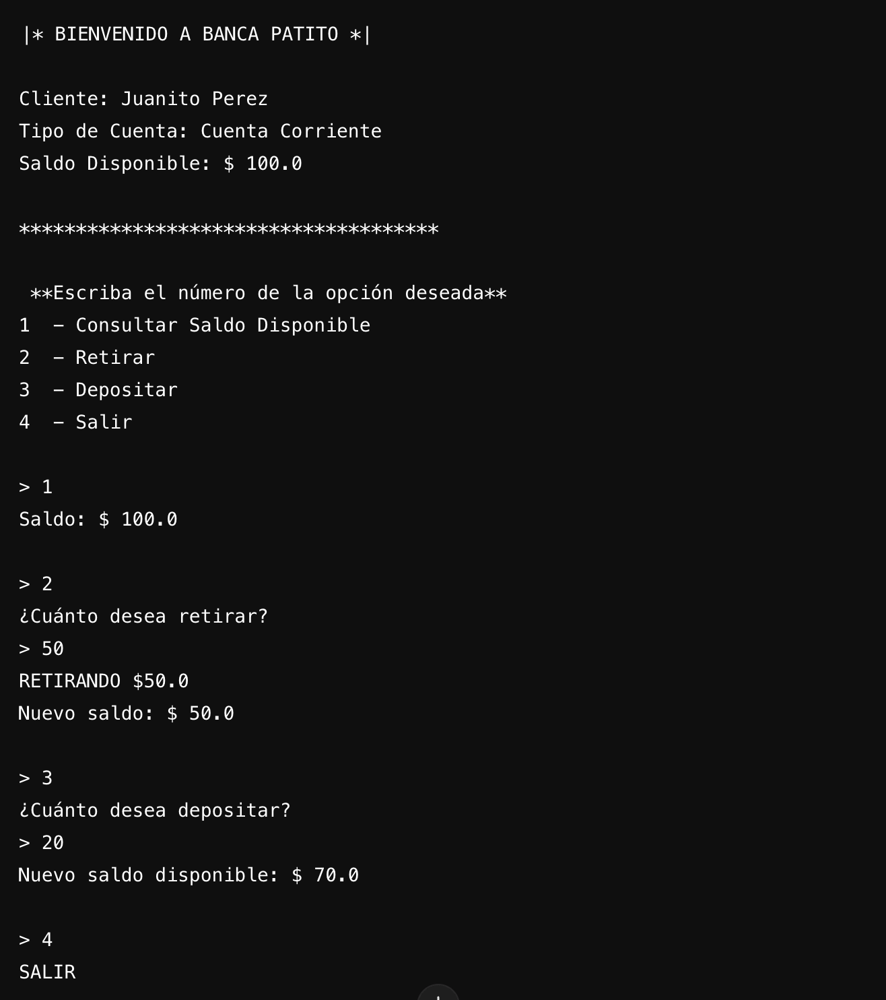

# Proyecto Cuenta Bancaria
Este ejercicio es una simulación de un sistema bancario simple desarrollado en Java, donde los usuarios pueden consultar su saldo, realizar retiros, depósitos y salir de la aplicación.

## Descripción del Proyecto

El programa presenta un menú interactivo que permite al cliente realizar las siguientes acciones:
- **Consultar Saldo Disponible:** Ver el saldo actual de la cuenta.
- **Retirar Dinero:** Retirar una cantidad si el saldo lo permite.
- **Depositar Dinero:** Incrementar el saldo de la cuenta con un depósito.
- **Salir:** Terminar la sesión.
  
- ## Estructura del Código

- **Clase `Main`**: Es el punto de entrada de la aplicación. Muestra la información del cliente y ejecuta la lógica del menú.
- **Clase `Menu`**: Contiene la información del cliente (nombre, tipo de cuenta y saldo)  proporciona un menú para las acciones disponibles.
- **Clase `Aplicacion`**: Controla las acciones del menú, como consultar saldo, retirar y depositar dinero.

## Ejemplo de salida en consola al ejecutar la aplicacion

